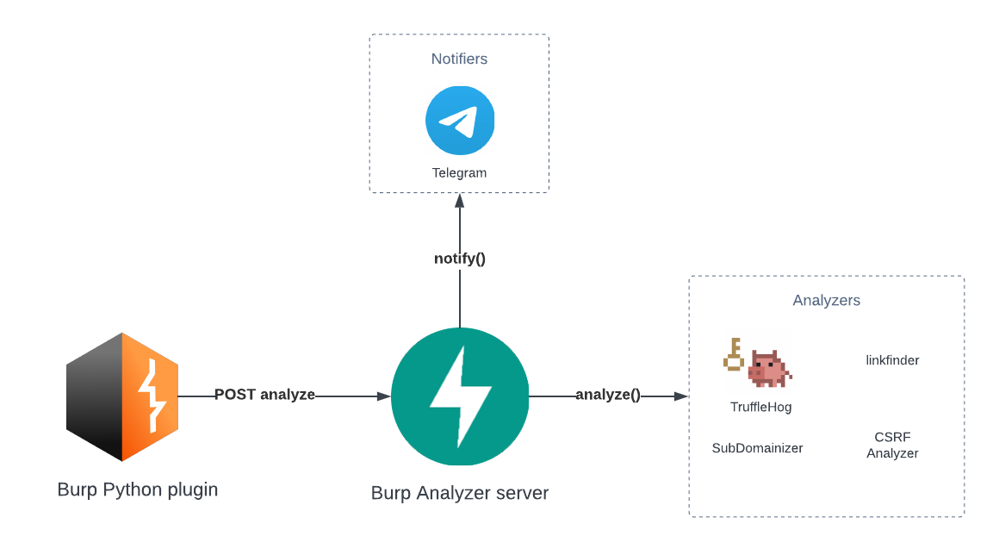

Burp Analyzer
=====

Personal tool for Bug Hunting utilizing an extension in `Burp Suite` to send all HTTP responses to a special
endpoint in FastAPI, where they are processed by various analyzers and send a notification to Telegram.

Install and run
----------

- Install the Burp plugin in burp-analyzer-plugin
- Install the Python requirements in requirements.txt with

    $ pip install -r requirements

- Run the server

    $ python .\burp-analyzer-server\main.py

Flowchart
----------------

